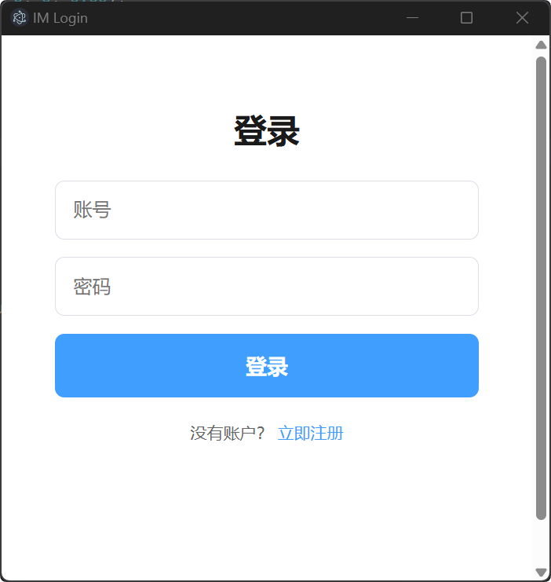
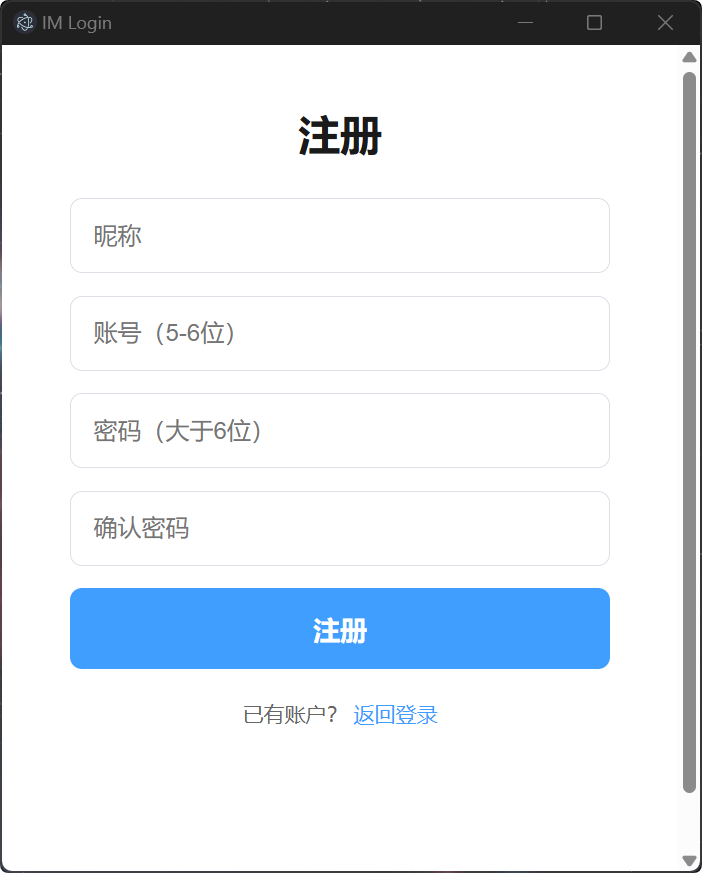
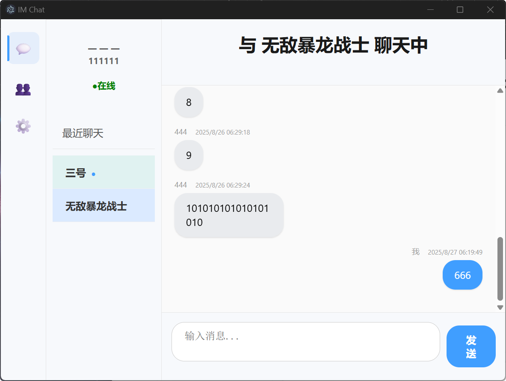
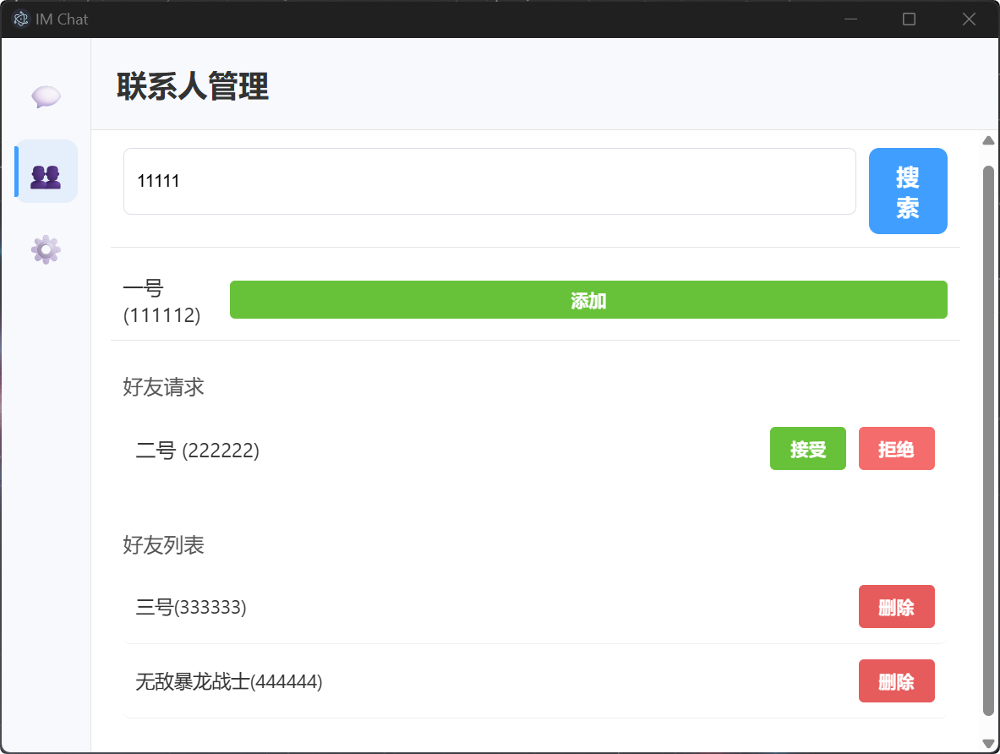
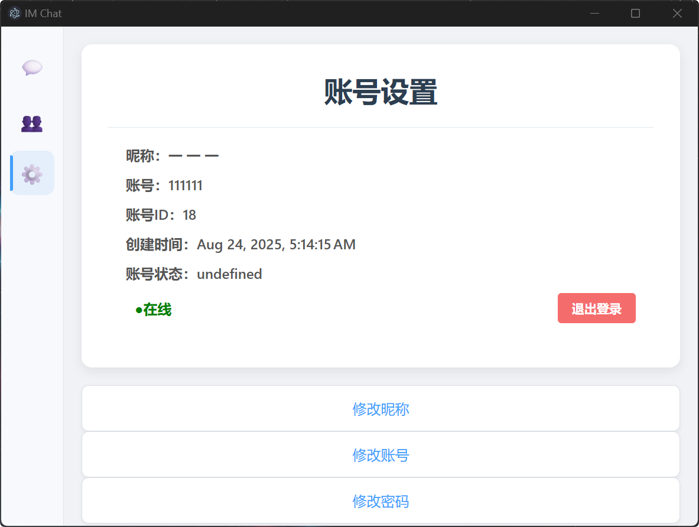

# IMchat
IMchat - 轻量级即时通讯系统
IMchat 是一个基于 Electron 前端 和 纯 Java 后端 构建的轻量级即时通讯（IM）桌面应用。项目旨在提供一个不依赖 Spring 等重型框架的最小可行性 IM 解决方案，专注于核心聊天功能的实现。

✨ 核心功能
用户系统:

安全的用户注册与登录

使用 JWT (JSON Web Token) 进行无状态身份认证

支持修改昵称等个人信息管理

实时通讯:

基于 WebSocket 的一对一单聊

心跳机制与断线自动重连，保证连接稳定性

消息管理:

支持离线消息存储与上线后自动推送

历史消息记录加载（滚动加载）

好友系统:

搜索用户并发起好友请求

处理好友请求（接受/拒绝）

好友列表展示与删除好友

🛠️ 技术栈
后端 (Java)
HTTP 服务: com.sun.net.httpserver.HttpServer (JDK 原生)

WebSocket 服务: org.java-websocket/Java-WebSocket

数据库连接: JDBC & mysql-connector-java

密码加密: at.favre.lib:bcrypt

JWT 认证: com.auth0:java-jwt

JSON 处理: com.google.code.gson:gson

构建工具: Maven

前端 (Electron)
框架: Electron

核心技术: HTML5, CSS3, JavaScript (ES6+)

通信协议: WebSocket, HTTP (Fetch API)

数据库
MySQL 9.0+

🚀 如何运行
1. 环境准备
安装 JDK 23 或更高版本

安装 Maven 3.6+

安装 Node.js 16+ 和 npm

安装 MySQL 9.0+

2. 数据库设置
登录你的 MySQL 服务器。

执行文件夹中 SQL 脚本，创建数据库和所需的数据表。

3. 运行后端服务
进入后端项目目录

修改 src/main/java/com/example/im/db/DatabaseManager.java 文件，将数据库用户名和密码替换为你自己的配置。

使用 Maven 编译和打包项目：

mvn clean package

运行生成的 JAR 文件：

java -jar target/im-java-backend-1.0-SNAPSHOT.jar

看到控制台输出 WebSocket server started... 和 HTTP API server started... 即表示后端启动成功。

4. 运行前端应用
进入前端项目目录

安装项目依赖：

npm install

启动 Electron 应用：

npm start

应用启动后，你就可以注册新用户并开始使用了！

🖼️ 项目截图

💡 未来计划
[ ] 群聊功能

[ ] 文件与图片传输

[ ] 用户在线状态显示

[ ] 端到端加密

[ ] 更完善的用户信息展示

📄 开源协议
本项目采用 MIT License 开源协议。
